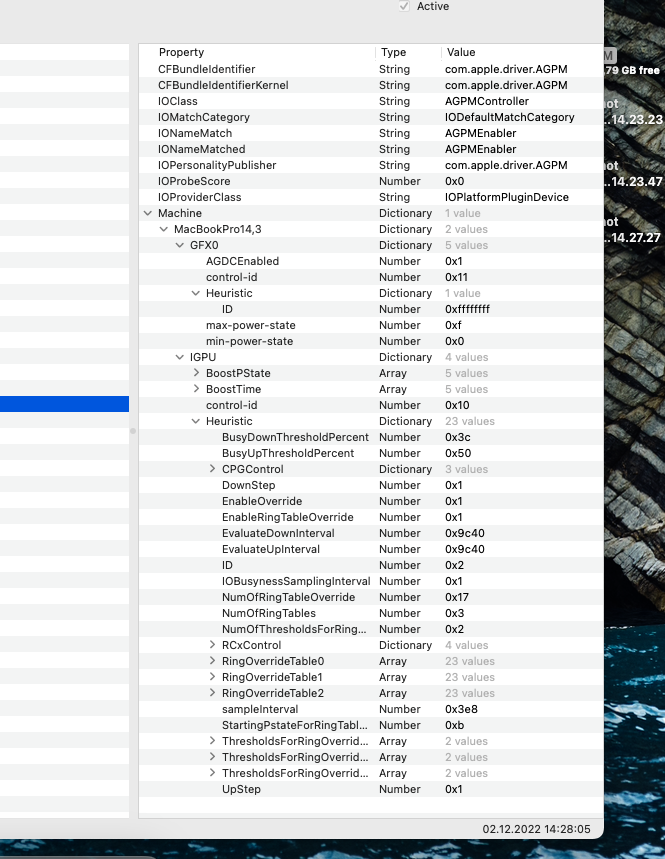

# Power Management on the Dell Precision M4700

## CPU Power Management

To have proper Power Management on Ivy Bridge CPUs like the M4700's, we need to have a couple of things:

- [A kernel patch to enable XCPM (Catalina+)](https://github.com/MasterK13/Dell-Precision-M4700-Hackintosh/blob/e1f0f8a131068f8087599542d0eec222951b89bb/EFI/OC/config.plist#L794-L823)
- An SSDT with the proper frequency vectors created by [SSDTPRGen](https://github.com/Piker-Alpha/ssdtPRGen.sh) on macOS Catalina (Very important, this has to be created for every individual laptop STRICTLY on macOS Catalina, even if they have the same CPU!)
- Because the BIOS hard-coded CFG-Lock as enabled, a set of Kernel Quirks is also needed:

| Quirk | Value | Description |
:---------|:---------|:----------
| AppleCpuPmCfgLock | YES | Disable when running Catalina or higher with XCPM |
| AppleXcpmCfgLock | YES | Disable when running any macOS version WITHOUT XCPM |
| AppleXcpmExtraMsrs | YES | Disable when running any macOS version WITHOUT XCPM |

For the kernel patch, paste the highlighted lines into the ```Kernel -> Patch``` section of your config.plist.
For the SSDT, install macOS Catalina and run SSDTPRGen, only then you can upgrade to higher versions.

## GPU Power Management

AGPM (Apple Graphics Power Management) is loaded by default without any modifications for both the iGPU and the dGPU. To check if it works for you, check if they're loaded in IOReg:



**If both of these are as in the images, then your Power Management is fully set-up and working properly.**